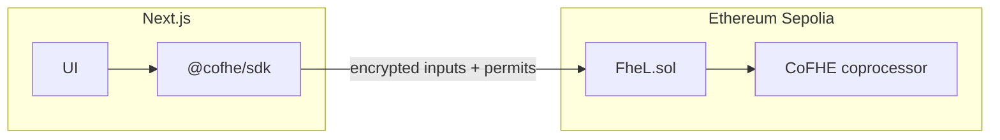

# fheL — Private Liquidation Engine (CoFHE / Sepolia)

fheL is a **testnet demonstration** of a **private liquidation engine** for DeFi-style positions: collateral and debt are stored as **encrypted values** (`euint64`) on Ethereum **Sepolia**, health checks use **Fhenix CoFHE** homomorphic comparisons, and liquidations can be triggered **without revealing position sizes** to observers.

This repository contains:

- **`contracts/`** — Hardhat project with `@cofhe/hardhat-plugin`, Solidity contract [`FheL.sol`](contracts/contracts/FheL.sol), tests on mocks, and a Sepolia deploy script.
- **`apps/web/`** — Next.js 14 app with **wagmi** + **viem** (injected wallet), **`@cofhe/sdk`** for encrypt/decrypt and permits, and a three-color UI (deep navy, cyan, violet) plus an animated **fheL** brand in the footer.

## What the app does

1. **Deposit** — User submits an encrypted deposit amount; the contract adds it to encrypted collateral.
2. **Borrow** — User submits an encrypted borrow amount; debt increases only if the encrypted check passes (**max borrow ≤ 80%** of collateral, expressed with public basis-point constants and FHE math).
3. **Liquidation** — Anyone can call `liquidate(user)`. The position is zeroed **only if** encrypted debt is **greater than** the encrypted liquidation threshold (**75%** of collateral in this MVP). No plaintext balances are required on-chain.
4. **Decrypt (owner)** — The connected user can **decrypt their own** collateral and debt handles off-chain using CoFHE **permits** and `decryptForView` (see [`useCofheClient`](apps/web/src/hooks/useCofheClient.ts) and the dashboard).

## Why it matters (product angle)

Public lending protocols expose collateral, debt, and health factors. That enables **MEV**, **liquidation bots**, and **whale tracking**. fheL illustrates how **FHE** can keep **numeric state confidential** while still allowing **programmable enforcement** of borrow limits and liquidation rules. This MVP uses **abstract units** and **fixed policy parameters** (no live price oracles) so the demo stays honest and deployable on Sepolia.

## Architecture



## Prerequisites

- **Node.js 18+**
- **Sepolia ETH** for deploy and transactions ([faucet](https://sepoliafaucet.com/) or others).
- A wallet (e.g. MetaMask) on **Sepolia** (chain ID **11155111**).

## Smart contracts

```bash
cd contracts
npm install
npm run compile
npm test
```

Deploy to Sepolia (set `PRIVATE_KEY` and optionally `SEPOLIA_RPC_URL` in `contracts/.env`):

```bash
cd contracts
npx hardhat run scripts/deploy.ts --network eth-sepolia
```

Copy the deployed address into the web app as `NEXT_PUBLIC_FHEL_CONTRACT_ADDRESS`.

Optional: verify on Etherscan if `ETHERSCAN_API_KEY` is set in `contracts/.env`.

### Protocol parameters (MVP)

| Constant            | Value | Meaning                                      |
|---------------------|-------|----------------------------------------------|
| `MAX_BORROW_BPS`    | 8000  | Max borrow = 80% of collateral (encrypted)   |
| `LIQUIDATION_BPS`   | 7500  | Liquidatable if debt > 75% of collateral     |
| `BPS`               | 10000 | Denominator                                  |

## Web app

```bash
cd apps/web
cp ../../.env.example .env.local
# Set NEXT_PUBLIC_FHEL_CONTRACT_ADDRESS and optionally NEXT_PUBLIC_SEPOLIA_RPC_URL
npm install
npm run dev
```

Open [http://localhost:3000](http://localhost:3000).

- **Landing** (`/`) — Product narrative and flow.
- **App** (`/app`) — Deposit, borrow, decrypt position.
- **Liquidate** (`/liquidate`) — Call `liquidate(address)` for another user.

## Environment variables

See [`.env.example`](.env.example) at the repo root. Typical entries:

- **Contracts:** `PRIVATE_KEY`, `SEPOLIA_RPC_URL`, `ETHERSCAN_API_KEY`
- **Web:** `NEXT_PUBLIC_FHEL_CONTRACT_ADDRESS`, `NEXT_PUBLIC_SEPOLIA_RPC_URL` (optional public RPC), `NEXT_PUBLIC_CHAIN_ID=11155111`

## Limitations and safety

- **Testnet demo** — Not audited; not financial advice.
- **No oracle** — Amounts are abstract **uint64 units**; there is no USD/ETH price feed in this MVP.
- **CoFHE** — Real FHE on Sepolia depends on Fhenix CoFHE availability; local tests use **mocks** via the Hardhat plugin.

## References

- [CoFHE documentation](https://cofhe-docs.fhenix.zone/)
- [Fhenix docs](https://docs.fhenix.zone/)

## License

MIT (contract and app code in this repo unless otherwise noted).
